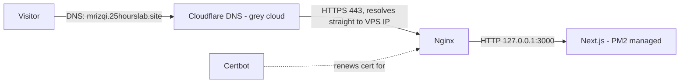

# 🚀 Deployment Guide & Release Instructions

> **Status: Drafted 2026-09-13** for the confirmed target: a self-managed **Ubuntu 22.04/24.04 VPS**, process-managed with **PM2**, reverse-proxied by **Nginx** with **Certbot** for TLS, domain **`mrizqi.25hourslab.site`**. Adjust IP/SSH details to your actual VPS before running these commands.

---

## 📋 1. Target Deployment Architecture

* **Target Platform:** Self-managed Linux VPS (Ubuntu 22.04/24.04)
* **Hosting Provider:** User-managed (not a PaaS like Vercel/Netlify)
* **Containerization:** None — running Next.js directly via Node.js + PM2 (kept minimal; add Docker later only if you outgrow this)
* **Web Server / Reverse Proxy:** Nginx, terminating TLS via Certbot (Let's Encrypt)
* **Domain:** `mrizqi.25hourslab.site`, a subdomain of `25hourslab.site` managed in **Cloudflare DNS**. Add an **A record** (`mrizqi` → VPS public IP) with the proxy status set to **DNS only (grey cloud)** before requesting a certificate — see §4a.



## ⚙️ 2. One-Time Server Setup

```bash
# 1. Update system
sudo apt update && sudo apt upgrade -y

# 2. Install Node.js LTS (via NodeSource — adjust version if the project's package.json engines change)
curl -fsSL https://deb.nodesource.com/setup_lts.x | sudo -E bash -
sudo apt install -y nodejs

# 3. Install PM2 globally
sudo npm install -g pm2

# 4. Install Nginx
sudo apt install -y nginx

# 5. Install Certbot (Nginx plugin)
sudo apt install -y certbot python3-certbot-nginx
```

## 📦 3. Deploying the App

```bash
# 1. Clone the repo (or pull latest on redeploy)
git clone <your-repo-url> ~/mrizqi-portofolio-website
cd ~/mrizqi-portofolio-website/source-codes/frontend

# 2. Install dependencies (devDependencies needed for the build step)
npm install

# 3. Build for production
npm run build

# 4. Start under PM2 (runs `next start`, defaults to port 3000)
pm2 start npm --name "mrizqi-portfolio" -- start

# 5. Persist PM2 across reboots
pm2 save
pm2 startup   # follow the printed instructions (runs a systemd-integration command once)
```

**Redeploying after a content/code change:**

```bash
cd ~/mrizqi-portofolio-website/source-codes/frontend
git pull
npm install
npm run build
pm2 restart mrizqi-portfolio
```

## ☁️ 4. Cloudflare DNS Setup

In the Cloudflare dashboard for `25hourslab.site` → **DNS** → **Records** → **Add record**:

| Field | Value |
|---|---|
| Type | `A` |
| Name | `mrizqi` |
| IPv4 address | your VPS's public IP |
| Proxy status | **DNS only** (grey cloud) |
| TTL | Auto |

**Why "DNS only" and not "Proxied" (orange cloud):** Certbot's `--nginx` plugin below uses the HTTP-01 challenge, which needs Let's Encrypt to reach your origin server directly on port 80 at `mrizqi.25hourslab.site`. With the record proxied, that traffic goes through Cloudflare's edge first — issuance often still works since Cloudflare forwards `/.well-known/acme-challenge/` by default, but DNS-only removes the variable entirely and is simpler to reason about for a low-traffic personal site that doesn't need Cloudflare's CDN/WAF layer.

*(Optional, later)*: once the certificate is issued and the site is confirmed working over HTTPS, you can switch the record to **Proxied** for Cloudflare's CDN/DDoS protection — set Cloudflare's SSL/TLS mode to **Full (strict)** first (Cloudflare validates your origin's Let's Encrypt cert), otherwise visitors can hit redirect loops or cert warnings.

## 🌐 5. Nginx Reverse Proxy + SSL

Create `/etc/nginx/sites-available/mrizqi-portfolio`:

```nginx
server {
    listen 80;
    server_name mrizqi.25hourslab.site;

    location / {
        proxy_pass http://127.0.0.1:3000;
        proxy_http_version 1.1;
        proxy_set_header Upgrade $http_upgrade;
        proxy_set_header Connection 'upgrade';
        proxy_set_header Host $host;
        proxy_set_header X-Real-IP $remote_addr;
        proxy_set_header X-Forwarded-For $proxy_add_x_forwarded_for;
        proxy_set_header X-Forwarded-Proto $scheme;
        proxy_cache_bypass $http_upgrade;
    }

    add_header X-Content-Type-Options "nosniff" always;
    add_header X-Frame-Options "SAMEORIGIN" always;
    add_header Referrer-Policy "strict-origin-when-cross-origin" always;
}
```

```bash
sudo ln -s /etc/nginx/sites-available/mrizqi-portfolio /etc/nginx/sites-enabled/
sudo nginx -t
sudo systemctl reload nginx

# Issue and auto-install the TLS certificate (also sets up HTTP→HTTPS redirect)
sudo certbot --nginx -d mrizqi.25hourslab.site
```

Certbot installs a renewal timer automatically (`systemctl status certbot.timer`) — no manual cron needed.

## 🔐 6. Environment & Secrets

* **No `.env` file is required.** This app has no API keys, database URLs, or secrets (see `docs/pasca-development/1-SECURITY-CHECKLIST.md`). Nothing to configure here beyond the app itself.

## 🤖 7. CI/CD — Auto-Deploy on Push to `main`

`.github/workflows/deploy.yml` runs on push/PR to `main`/`dev`, scoped to changes under `source-codes/frontend/**` (this repo has no other deployable service, so a docs-only or backend-scaffold commit never triggers a build/deploy):

* **`build` job** (always) — `npm ci && npm run build` in `source-codes/frontend`, catches type/lint/build errors before merge.
* **`deploy` job** (only on push to `main`, after `build` passes) — SSHes into the VPS via [`appleboy/ssh-action`](https://github.com/appleboy/ssh-action) and runs the same `git pull` → `npm install` → `npm run build` → `pm2 restart mrizqi-portfolio` sequence documented in §3, non-interactively.

**One-time setup — add these as GitHub repo secrets** (`Settings → Secrets and variables → Actions → New repository secret`):

| Secret | Value |
|---|---|
| `VPS_HOST` | VPS IP address or hostname |
| `VPS_USERNAME` | SSH user with permission to `git pull`, run `npm`, and `pm2 restart` in `~/mrizqi-portofolio-website` |
| `VPS_SSH_KEY` | Private key (PEM) for that user — generate a **dedicated deploy key** (`ssh-keygen -t ed25519 -f deploy_key -N ""`), add `deploy_key.pub` to the VPS user's `~/.ssh/authorized_keys`, and paste the contents of the private `deploy_key` file here. Never reuse your personal SSH key. |
| `VPS_PORT` | *(optional)* SSH port, defaults to `22` if unset |

The deploy step assumes the repo is already cloned at `~/mrizqi-portofolio-website` on the VPS (§3 step 1) and that `pm2 start npm --name "mrizqi-portfolio" -- start` has been run at least once, so `pm2 restart` has a process to target.

## ✅ 8. Post-Deploy Verification

* [ ] `https://mrizqi.25hourslab.site/` loads with a valid padlock (TLS).
* [ ] All 5 routes reachable: `/`, `/projects`, `/project?p=arcibo`, `/blog`, `/post?p=clean-architecture-flutter`.
* [ ] `pm2 status` shows `mrizqi-portfolio` as `online`.
* [ ] `pm2 logs mrizqi-portfolio --lines 50` shows no startup errors.
* [ ] Reboot the VPS once and confirm the app comes back automatically (`pm2 startup` + `pm2 save` did their job).
