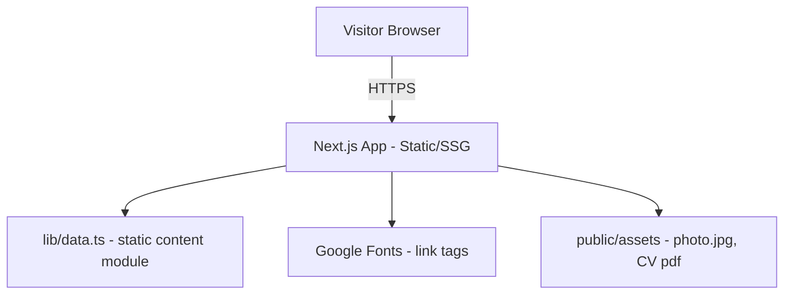

# System Architecture & Technical Specifications

> **Status: LOCKED** — confirmed with the user: TypeScript, Next.js App Router. Styling ports the source `css/styles.css` near-verbatim as global CSS (not Tailwind) to guarantee pixel fidelity with the source design, per the PRD's "copy exactly" requirement.

---

## 🏗 1. High-Level System Overview



No API layer, no database, no auth — content is compiled into the app from a static TypeScript module, same role as the source's `js/data.js`.

## ⚙️ 2. Tech Stack & Dependencies

* **Core Framework:** Next.js (latest stable, App Router)
* **Language:** TypeScript
* **State Management:** Local React state only (`useState`/`useEffect`) for filters and accordion — no Redux/Zustand, matches the source's plain-JS DOM state.
* **Routing/Navigation:** Next.js App Router file-based routing. Detail pages keep the source's **query-string** pattern (`?p=<slug>`) instead of dynamic segments, to preserve the exact URL/behavior contract documented in `docs/design/mrizqi-portofolio-design/DESIGN.md` ("reads `?p=<slug>`").
* **Network / API Client:** None — no fetch/axios, all data is imported directly from `lib/data.ts`.
* **Local Storage / Caching:** None.
* **Styling / UI Library:** Plain CSS, ported from the source `css/styles.css` into `app/globals.css` with class names preserved. No Tailwind, no CSS-in-JS, no component library — matches source 1:1.

## 📁 3. Project Directory Structure

```text
source-codes/frontend/
 ├── app/
 │    ├── layout.tsx          # <html>/<body>, Google Fonts <link> tags, imports globals.css
 │    ├── globals.css         # ported from css/styles.css (design tokens at the top)
 │    ├── page.tsx            # home (index.html)
 │    ├── projects/
 │    │    └── page.tsx       # projects list (projects.html)
 │    ├── project/
 │    │    └── page.tsx       # project detail, reads ?p= via useSearchParams (project.html)
 │    ├── blog/
 │    │    └── page.tsx       # blog list (blog.html)
 │    └── post/
 │         └── page.tsx       # post detail, reads ?p= via useSearchParams (post.html)
 ├── components/
 │    ├── Nav.tsx             # shared sticky nav, active-link highlighting
 │    ├── Footer.tsx          # shared footer
 │    ├── Reveal.tsx          # scroll-reveal wrapper (IntersectionObserver hook)
 │    ├── ProjectCard.tsx     # tile-link card (shared by home + projects list)
 │    ├── PostCard.tsx        # tile-link card (shared by home + blog list)
 │    ├── SkillsGrid.tsx
 │    ├── ExperienceAccordion.tsx
 │    ├── FilterBar.tsx       # generic category/tag filter (used by projects + blog)
 │    └── ProjectPrevNext.tsx / PostPrevNext.tsx
 ├── lib/
 │    └── data.ts             # PROJECTS, CATEGORIES, POSTS, TAGS, ROLE_HISTORY, SKILL_GROUPS (ported from js/data.js)
 ├── public/
 │    └── assets/
 │         ├── photo.jpg
 │         └── CV_Muhammad_Rizqi.pdf
 ├── next.config.ts
 ├── tsconfig.json
 └── package.json
```

## 🔄 4. Core Patterns & Guidelines

* **Architecture Pattern:** Simple component-per-section, no layered architecture (no domain/data/presentation split) — the app has no backend calls to warrant it. This intentionally does **not** follow `.claude/rules/05-mobile-standards.md`'s Clean Architecture layering, which applies to the mobile scaffold, not this static frontend.
* **Dependency Injection:** None needed — no services to inject.
* **State Management Rule:** Filter/accordion state lives in the component that owns the UI (`FilterBar`, `ExperienceAccordion`); no global store.
* **Data Flow:** Page component → imports from `lib/data.ts` → passes props to presentational card/list components. Detail pages resolve the active item from `useSearchParams().get('p')` client-side (mirrors the source's `location.search` read in `app.js`), so `project/page.tsx` and `post/page.tsx` are Client Components.
* **Naming:** All file, folder, function, and variable names in English (per user instruction), matching the source design's English content.

## 🛡 5. Error Handling & Logging

* **Global Error Handling:** None required — no network calls to fail. If a `?p=<slug>` doesn't match any item, detail pages fall back the same way the source does (`arcibo` for projects, first item for posts).
* **User Feedback:** Not applicable — no async states.
* **Logging Strategy:** None — static app, no server-side logging surface.

## 🔐 6. Security Guidelines

* **Environment Variables:** None required — no secrets, no API keys, no `.env` needed for the app to run.
* **Token Storage:** Not applicable — no auth.
* **Input Validation:** The only "input" is the `?p=` query param, which is only ever used to look up a slug in a static in-memory array (never rendered as raw HTML/executed), so no injection surface.

---
> **Next:** `5-ERD.md` and `6-API-CONTRACT.md` are marked N/A (no database, no API — see those files). `7-USER-FLOW.md` maps the page navigation. `8-UI-UX-GUIDELINES.md` mirrors `docs/design/DESIGN.md` tokens.
