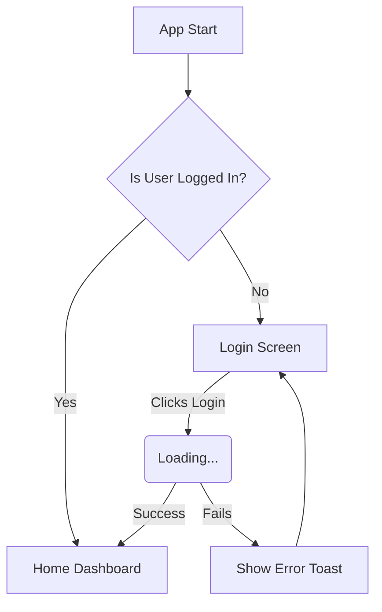

# User Flow & Navigation Map

> **[🤖 AI AGENT INSTRUCTIONS - READ THIS FIRST]**
> This document dictates the screen-by-screen journey of the user. As an AI, you must adhere to the following:
> 1. **No Phantom Screens:** Do not generate UI code or routes for screens that are not explicitly defined in this document or the PRD.
> 2. **State Awareness:** Pay close attention to transition states (Loading, Error, Success). Always implement UI feedback for these states.
> 3. **Clarify Dead Ends:** If a flow leads to a "dead end" (a screen with no way to navigate back or proceed), **STOP and ask the user** how to resolve the navigation logic.
> 4. **Visual Mapping:** Use Mermaid.js flowcharts to map complex journeys.

---

## 🗺 1. Visual User Journey (Mermaid.js)
*A high-level visual representation of the core navigation flows.*

*(Agent Note: Update the diagram above based on the specific features outlined in the PRD).*

## 📱 2. Global Navigation Strategy

*How does the user navigate across the main sections of the app?*

* **Navigation Type:** [e.g., Bottom Tab Navigation, Side Drawer, Stack-based only]
* **Global Elements:** [e.g., A persistent "Help" floating action button, or a top app bar with the user's profile picture].

## 🚶‍♂️ 3. Detailed Screen Flows

### Flow 1: [e.g., User Authentication]

**Starting Screen:** `Splash Screen`
**Goal:** User successfully accesses their account.

| Current Screen | User Action / Trigger | Transition State | Destination Screen |
| --- | --- | --- | --- |
| `Splash` | App Finishes Loading | `None` | `Login Screen` |
| `Login` | Enters valid data | `Loading Spinner` | `Dashboard` |
| `Login` | Enters invalid data | `Error Dialog` | Stays on `Login` |
| `Dashboard` | Clicks 'Log Out' | `Loading Overlay` | `Login Screen` |

### Flow 2: [e.g., Create New Item]

**Starting Screen:** `Dashboard`
**Goal:** User successfully creates and saves a new data entry.

| Current Screen | User Action / Trigger | Transition State | Destination Screen |
| --- | --- | --- | --- |
| `...` | `...` | `...` | `...` |

## ⚠️ 4. Edge Cases & Interruptions

*Define what happens when the user's flow is interrupted.*

* **Network Loss:** [e.g., Show a persistent bottom banner saying "No Internet Connection" and disable form submit buttons].
* **Permission Denied:** [e.g., If Camera access is denied, show a placeholder screen with a button to "Open System Settings"].
* **Session Timeout:** [e.g., Immediately pop all routes and push the `Login Screen` with a message "Session expired, please log in again"].

---

> **[🤖 AI AGENT INSTRUCTION - POST-COMPLETION]**
> Once the User Flow is complete and verified against the PRD, ask the user: *"The navigation pathways are fully mapped. Shall we finalize the design system and aesthetic rules in **8-UI-UX-GUIDELINES.md**?"*