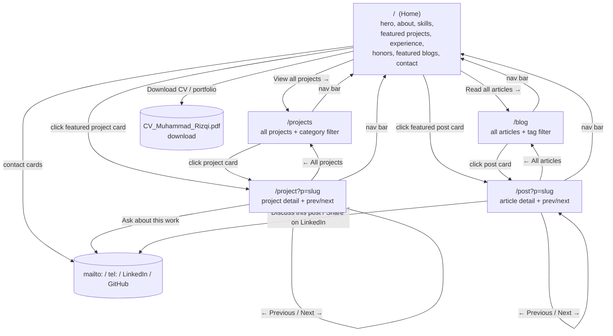

# User Flow & Navigation Map

> **Status: LOCKED** — matches the existing navigation in the source design (`docs/design/mrizqi-portofolio-design/*.html`); no new screens added.

---

## 🗺 1. Visual User Journey (Mermaid.js)

## 📌 2. Notes

* Nav bar (present on every page) always links to `Home`, `Home#about`, `Home#skills`, `Projects`, `Blog`, `Home#contact`, plus the CV download button — no dead ends, every page can always return home.
* `ProjectDetail` and `PostDetail` prev/next wrap around the list (last item's "Next" goes to the first item), same as the source `app.js` (`(i + 1) % list.length`).
* No loading/error states: all data is static and bundled, so there is no network-loading UI to design. An unknown `?p=` slug falls back to a default item (`arcibo` for projects, first item for posts) rather than a 404/error screen — matches source behavior exactly.
