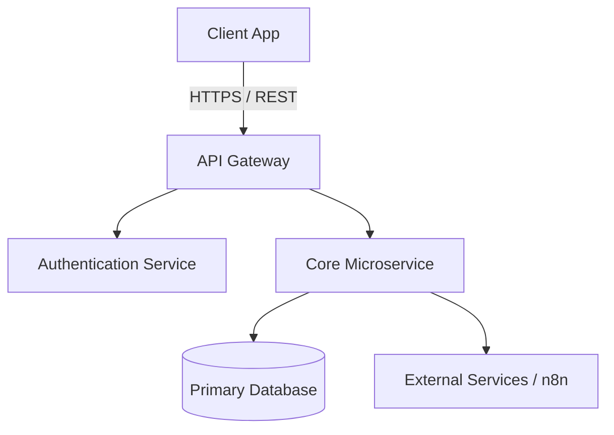

# System Architecture & Technical Specifications

> **[🤖 AI AGENT INSTRUCTIONS - READ THIS FIRST]**
> This document is the ultimate technical blueprint. Before writing any code, generating project structures, or installing dependencies, you MUST consult this document.
> 1. **Strict Adherence:** Do not deviate from the Tech Stack, State Management, or Folder Structure defined here. If a required feature cannot be implemented with the listed stack, **STOP and ask the user** for permission to add a new library.
> 2. **No Hallucinated Imports:** Only use packages and architectural patterns explicitly approved in this document.
> 3. **Diagrams:** Use Mermaid.js for system architecture and data flow visualizations. It helps both the user and the AI maintain a clear mental model.

---

## 🏗 1. High-Level System Overview
*Describe how the major components (Client, Server, Database, Third-Party APIs) interact. Use a Mermaid.js diagram for clarity.*



*(Edit the Mermaid diagram above to reflect the actual system architecture).*

## ⚙️ 2. Tech Stack & Dependencies

*Define the exact technologies, frameworks, and critical packages to prevent the AI from using deprecated or incompatible libraries.*

* **Core Framework:** [e.g., Flutter / React Native / Next.js]
* **Language:** [e.g., Dart 3.x / TypeScript]
* **State Management:** [e.g., BLoC / Redux / Zustand]
* **Routing/Navigation:** [e.g., GoRouter / React Router]
* **Network / API Client:** [e.g., Dio / Axios / RTK Query]
* **Local Storage / Caching:** [e.g., Hive / SharedPreferences / SQLite]
* **Styling / UI Library:** [e.g., TailwindCSS / Material 3 / Custom Design System]

## 📁 3. Project Directory Structure

*Define the exact folder structure so the AI agent knows exactly where to place new files (e.g., Feature-First approach or Domain-Driven Design).*

```text
/src (or /lib)
 ├── /core           # Base classes, theme, constants, extensions
 ├── /config         # Environment variables, routing setup, theme config
 ├── /features       # Feature-first modules
 │    ├── /auth      # Example feature
 │    │    ├── /data         # Repositories, models, API data sources
 │    │    ├── /domain       # Entities, use cases
 │    │    └── /presentation # UI, widgets, state (BLoC/Controllers)
 ├── /shared         # Reusable UI components (buttons, text fields)
 └── main            # App entry point

```

## 🔄 4. Core Patterns & Guidelines

*Rules on how specific coding tasks must be executed.*

* **Architecture Pattern:** [e.g., Clean Architecture, MVC, MVVM]
* **Dependency Injection:** [e.g., GetIt / Riverpod / InversifyJS - Explain how dependencies should be injected and located].
* **State Management Rule:** [e.g., "UI must not contain business logic. All logic must reside in BLoC. UI only listens to state changes."]
* **Data Flow:** [e.g., UI -> BLoC/Controller -> UseCase -> Repository -> Remote/Local DataSource].

## 🛡 5. Error Handling & Logging

*Standardize how the application handles failures.*

* **Global Error Handling:** [e.g., Wrap network calls in a `Result` or `Either` type (Left for Failure, Right for Success)].
* **User Feedback:** [e.g., Show a customized Snackbar for network errors, redirect to login on 401 Unauthorized].
* **Logging Strategy:** [e.g., Use a dedicated logger class instead of standard `print()` or `console.log()`].

## 🔐 6. Security Guidelines

*Critical security constraints.*

* **Environment Variables:** [e.g., All API URLs and Keys must be stored in `.env` and accessed via a config class].
* **Token Storage:** [e.g., Use Flutter Secure Storage / Encrypted SharedPreferences for JWT tokens].
* **Input Validation:** [e.g., All user inputs must be validated on the client side before submission].

---

> **[🤖 AI AGENT INSTRUCTION - POST-COMPLETION]**
> Once the architecture is defined and approved, ask the user: *"The technical blueprint is ready. Should we proceed to define the data structures in **5-ERD-TEMPLATE.md**, define the endpoints in **6-API-CONTRACT-TEMPLATE.md**, or move to visual planning with **7-USER-FLOW-TEMPLATE.md**?"*
